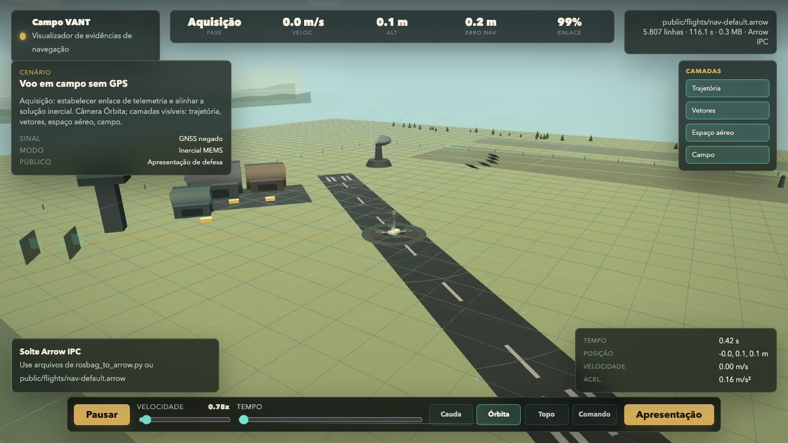
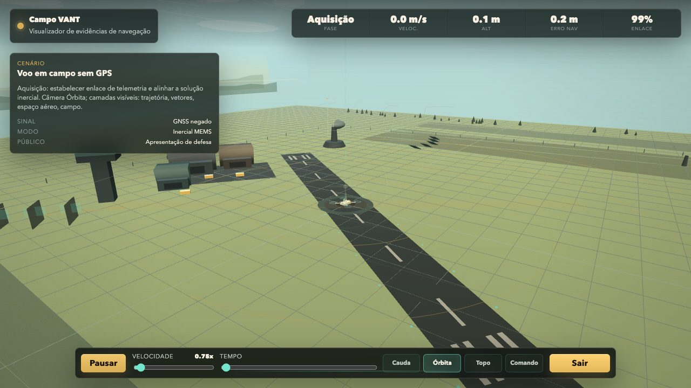
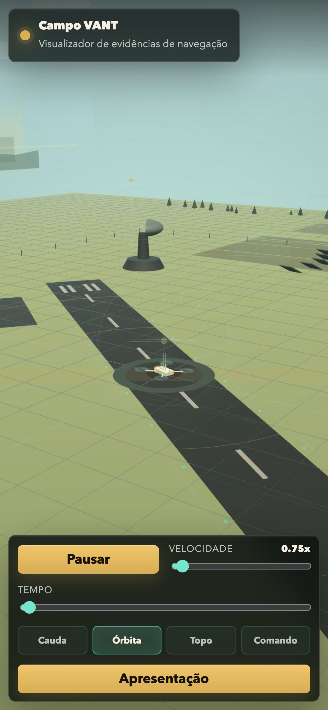

# sedenion

> A Rust implementation of the 16-dimensional Cayley-Dickson algebra, plus two
> reproducible bakeoffs that separate useful structure from overclaim.

Sedenions are mathematically tempting: they are power-associative, noncommutative,
nonassociative, and the first Cayley-Dickson algebra with zero divisors. This repo
does not treat that as automatic evidence of usefulness. It packages the reusable
algebraic pieces, then tests two concrete claims:

- **Representation learning:** can a sedenion-structured 16-D projector plus
  zero-divisor-aware regularization improve a small LeJEPA/SIGReg-style SSL probe?
- **GPS-denied navigation:** can mapping a MEMS inertial-navigation state into a
  sedenion improve a standard UKF or encode strapdown physics automatically?

The answers are deliberately asymmetric:

| Track | Current Result | Practical Takeaway |
|---|---|---|
| `sedenion/` | reusable algebra crate | Keep the 64-byte `Sedenion`, `L_a/R_a` operators, sketches, and extracted auto-ZDA API. |
| `repr-bakeoff/` | **positive in this narrow harness** | Auto-balanced ZDA beats dense under the checked SIGReg objective without a raw `λ_zda` sweep. |
| `nav-bakeoff/` | **negative for state-manifold navigation claims** | Sedenions do not improve the tested UKF; use them, if at all, as operator templates or diagnostics. |

## Toolchain

The repo is pinned to **Rust 1.96.0** in [`rust-toolchain.toml`](rust-toolchain.toml).
The host machine may default to nightly, so keep the pin when reproducing results.

```bash
rustc --version
cargo --version
```

Expected:

```text
rustc 1.96.0
cargo 1.96.0
```

This is not a Cargo workspace. Run commands from each crate directory.

## What Is Implemented

### Algebra Crate: `sedenion/`

The `sedenion` crate provides the reusable deliverable:

- `Quaternion`, `Octonion`, and `Sedenion` Cayley-Dickson types.
- `Sedenion` as `#[repr(C, align(64))]`, exactly 16 `f32`s / 64 bytes.
- Full sedenion multiplication and O(N) squaring for polynomial predictors.
- Left/right multiplication matrices `L_a` and `R_a`.
- Zero-cost subalgebra sketches for 4-D, 8-D, and 15-D projections.
- Zero-divisor diagnostics.
- Triangular-root support diagnostics: geometric roots, strong/ghost/bad mask
  classification, and the verified `30 + 36 + 32701` support split.
- The extracted auto-ZDA representation-learning API:
  `zda_score`, `zda_loss_and_grad`, `zda_batch_loss_and_grad`, and
  `auto_zda_gradient_scale`.

Minimal use:

```rust
use sedenion::{
    auto_zda_gradient_scale, classify_triangular_support, zda_batch_loss_and_grad,
    Sedenion, TriangularSupport,
};

let z = Sedenion::new([
    1.0, 2.0, 3.0, 4.0,
    5.0, 6.0, 7.0, 8.0,
    9.0, 10.0, 11.0, 12.0,
    13.0, 14.0, 15.0, 16.0,
]);

let z2 = z.square();
let left = z.left_mul_matrix();
let score = z.zda_score();
let (loss, grad) = z.zda_loss_and_grad();

let support = z.support_mask(1e-6);
let support_class = classify_triangular_support(support);
assert!(matches!(
    support_class,
    TriangularSupport::Strong { .. } | TriangularSupport::Ghost { .. } | TriangularSupport::Bad
));

let batch = [z, z2];
let (batch_loss, batch_grad) = zda_batch_loss_and_grad(&batch);
let scale = auto_zda_gradient_scale(1.0, 0.05, 0.10, 0.4);
```

The current ZDA loss is not the old raw zero-divisor distance. It uses the
scale-invariant score

```text
sqrt((||A||^2 - ||B||^2)^2 + (2 A.B)^2) / (||A||^2 + ||B||^2)
```

then applies a repulsive `-log(score)` barrier plus an N(0,I)-motivated radial norm
floor. During training, `auto_zda_gradient_scale` matches the ZDA gradient RMS to
the base objective and only boosts while embeddings are under the target RMS.

See [`sedenion/README.md`](sedenion/README.md) for the crate API, benchmarks, and
hardware notes.

### Representation Bakeoff: `repr-bakeoff/`

`repr-bakeoff` asks whether the sedenion structure helps self-supervised
representations under the checked LeJEPA/SIGReg objective.

The comparison is intentionally small and controlled:

- Dense real projector: 16 x 256 weights, 4112 parameters with bias.
- Sedenion projector: 16 sedenion weights plus bias, 272 parameters.
- Same synthetic and MNIST frozen-backbone inputs.
- Same downstream linear probe.
- SIGReg checked against a dependency-free Python reference value:
  `2.07709580`.

Current headline results:

| Dataset | Dense SIGReg | Sedenion, ZDA Off | Sedenion, Auto-ZDA |
|---|--:|--:|--:|
| Synthetic probe accuracy | 90.3% | 87.4% | **92.8%** |
| MNIST frozen-backbone probe accuracy | 30.7% | 10.3% | **41.0%** |

The important correction is conceptual: raw `λ_zda` sweeps were the wrong
interface. The useful method is a parameter-free barrier whose gradient is balanced
against the current base SIGReg/invariance gradient.

See [`repr-bakeoff/README.md`](repr-bakeoff/README.md) for full tables, metrics,
and caveats.

### Navigation Bakeoff: `nav-bakeoff/`

`nav-bakeoff` tests a separate claim: that a 16-D sedenion state representation can
improve GPS-denied inertial navigation with low-cost MEMS IMUs.

The result is negative:

- With no aiding, every `λ` is identical because accelerometer bias is unobservable.
- With 30 s position fixes, turning on the sedenion/ZDA projection degrades RMSE.
- The bilinear operator probe shows most strapdown coupling is outside the
  sedenion-reachable operator subspace.

Headline navigation numbers:

| Experiment | Baseline / λ=0 | Sedenion λ=1 | Result |
|---|--:|--:|---|
| Linear MEMS, aided terminal RMSE | 20.8 m | 35.0 m | worse |
| Duffing MEMS, aided terminal RMSE, 16 seeds | 19.4 m | 23.1 m | worse |
| Dead reckoning terminal RMSE | 1346.8 m | 1346.8 m | identical |
| Strapdown projection residual | ρ ≈ 0.90-0.96 | n/a | mostly outside algebra |

The useful navigation artifact is not a sedenion physical state manifold. It is the
operator infrastructure: `L_a`, `R_a`, condition-number diagnostics near zero
divisors, and a projection residual test for whether a proposed physical coupling
actually lives in the algebra.

See [`nav-bakeoff/README.md`](nav-bakeoff/README.md),
[`nav-bakeoff/PAPER.md`](nav-bakeoff/PAPER.md), and
[`nav-bakeoff/OPERATOR_ALGEBRA.md`](nav-bakeoff/OPERATOR_ALGEBRA.md).

### UAV Flight Viewer: `uav-viewer/`

`uav-viewer` is a browser-based Three.js viewer for Arrow IPC flight exports from
`nav-bakeoff`. It is not a new navigation result; it is an inspection and briefing
surface for GPS-denied UAV trajectories, with pt-BR controls, orbit/top/command
camera presets, trajectory/vector/range layers, and a daylight test-range scene.







## Reproduce

Because the crates are independent, `cd` into each one.

### Algebra Crate

```bash
cd sedenion
cargo test --release
cargo bench
```

### Representation Bakeoff

```bash
cd repr-bakeoff
cargo test --release
python3 tools/ref_pure.py
cargo run --release
./fetch_mnist.sh
cargo run --release -- mnist
```

Expected reference check:

```text
mean_over_slices_noN = 2.07709580
```

Expected current result shape:

```text
Synthetic: Sedenion ZDA auto 92.8% vs dense 90.3%
MNIST:     Sedenion ZDA auto 41.0% vs dense 30.7%
```

### Navigation Bakeoff

```bash
cd nav-bakeoff
cargo test --release
cargo run --release --bin nav-bakeoff
cargo run --release --bin nav-bakeoff -- 16 300 --duffing
cargo run --release --bin bilinear-probe
cargo run --release --bin nav-repr-bakeoff
```

Expected current result shape:

```text
Linear aided terminal: 20.8 m baseline/λ=0, 35.0 m λ=1
Duffing aided terminal: 19.4 m baseline/λ=0, 23.1 m λ=1
Projection residual: ρ_full ≈ 0.90-0.96
Nav repr: dense 16-D is the current best held-out predictor family;
JEPA-pretrain + fine-tune improves dense proxy MSE, while the best filter-in-loop
RMSE is still supervised dense. Current 180 s non-Duffing filter check: dead
reckoning 531.46 m; supervised dense bias aid 452.64 m; dense JEPA+fine-tune
459.84 m; sedenion+auto-ZDA 518.64 m.
```

### UAV Flight Viewer

The viewer replays an Arrow IPC flight exported by `nav-bakeoff`. Generate a default
flight first (it is gitignored), then serve the app. Uses **pnpm**; a local
`uav-viewer/pnpm-workspace.yaml` makes it a self-contained pnpm root.

```bash
cd nav-bakeoff
cargo run --release --bin export-uav-arrow   # writes ../uav-viewer/public/flights/nav-default.arrow
cd ../uav-viewer
pnpm install                                  # self-contained; do not use npm
pnpm dev                                       # http://127.0.0.1:5173/
```

Or drag-drop any Arrow IPC flight onto the running page. `pnpm build` (`tsc && vite build`)
produces a static bundle in `dist/`.

## Evidence Map

| Claim | Artifact |
|---|---|
| Sedenion product, inverse, power, and sketches behave as implemented | `sedenion/src/lib.rs`, `cargo test --release` in `sedenion/` |
| `L_a.b = a.b`, `R_a.b = b.a`, `L_a^T = L_conj(a)`, and `L_ab != L_a L_b` | `sedenion` tests and `nav-bakeoff/OPERATOR_ALGEBRA.md` |
| Auto-ZDA is the exported crate method, not private bakeoff code | `sedenion::zda_loss_and_grad`, `zda_batch_loss_and_grad`, `auto_zda_gradient_scale`; consumed by `repr-bakeoff` |
| SIGReg forward matches the LeJEPA-style reference port | `repr-bakeoff/tools/ref_pure.py`, `repr-bakeoff/tests/sanity.rs` |
| Auto-ZDA improves the controlled representation probe | `cargo run --release` and `cargo run --release -- mnist` in `repr-bakeoff/` |
| Sedenion navigation state projection does not help the tested UKF | `cargo run --release --bin nav-bakeoff` in `nav-bakeoff/` |
| Strapdown physics mostly does not live in the sedenion operator subspace | `cargo run --release --bin bilinear-probe` in `nav-bakeoff/` |
| Sedenions as learned MEMS representations are tested separately from state replacement | `cargo run --release --bin nav-repr-bakeoff` in `nav-bakeoff/` |

## Repository Layout

```text
.
├── rust-toolchain.toml          Rust 1.96.0 pin
├── sedenion/                    reusable Cayley-Dickson algebra crate
│   ├── src/lib.rs               core types, operators, sketches, auto-ZDA
│   ├── benches/                 Criterion benchmarks
│   └── README.md                crate-level API and performance notes
├── repr-bakeoff/                representation-learning experiment
│   ├── src/                     data, model, SIGReg, training, metrics
│   ├── tests/                   gradient and reference checks
│   ├── tools/ref_pure.py        dependency-free SIGReg reference port
│   └── README.md                results and interpretation
├── nav-bakeoff/                 inertial-navigation experiment
│   ├── src/                     UKF, simulation, filters, bilinear probe
│   ├── tests/                   equivalence and operator guardrails
│   ├── PAPER.md                 full writeup
│   ├── OPERATOR_ALGEBRA.md      `L_a/R_a` and projection-residual notes
│   └── README.md                navigation results
├── uav-viewer/                  Three.js Arrow IPC flight viewer
├── docs/assets/                 README screenshots and visual assets
├── sedenion_lejepa.md           representation-learning design notes
├── MEMORY.md                    project decisions and current conclusions
└── memory/                      daily raw notes
```

Generated Cargo `target/` directories and downloaded MNIST data are not repo
deliverables. Keep build output out of version control.

## What Not To Claim

- Do not claim "sedenions improve navigation" from this repo. The tested
  navigation path is negative.
- Do not claim "zero divisors are anti-jamming sinks." They create singular
  operators and blind directions.
- Do not claim the old raw ZDA distance is the method. It was superseded by the
  repulsive, scale-aware auto-ZDA barrier.
- Do not claim the representation result is a full SSL benchmark. It is a narrow,
  reproducible probe with a tiny 16-D bottleneck and fixed training recipe.
- Do not use raw `λ_zda` sweeps as the primary interface. The current deliverable
  is gradient-balanced auto-ZDA.

## Current Verdict

The defensible position is narrow but useful:

- **Keep** the sedenion crate as a compact 16-D algebra implementation.
- **Keep** `L_a/R_a` as operator templates and diagnostics.
- **Keep** auto-ZDA as the extracted representation-learning method to test next.
- **Reject** sedenions as a drop-in physical state manifold for the tested
  GPS-denied navigation problem.
- **Treat** all broader LeJEPA/world-model claims as hypotheses that still need
  stronger baselines, deeper models, and larger data.
